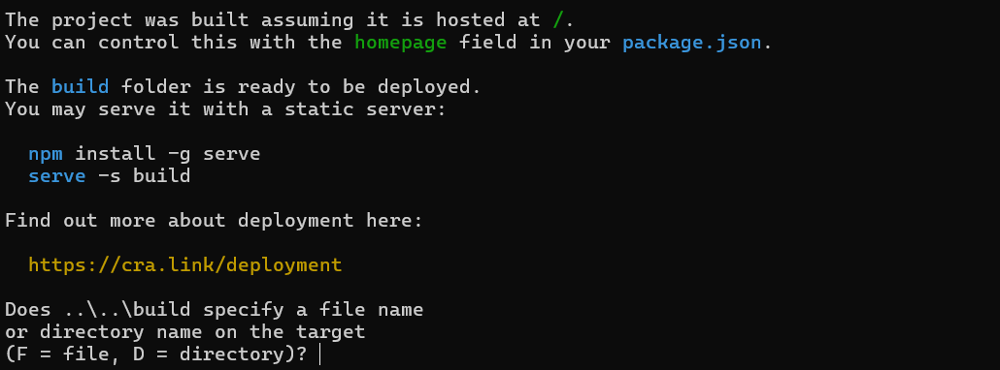

# Aplikacja do zautomatyzowanej analizy PCA i klasteryzacji

**Autorzy**: Michał Bert, Michał Czajor, Jakub Kędra, Karol Kiszka, Adrian Madej

### Zależności
Aplikacja wymaga aby użytkownik miał zainstalowany na swoim komputerze
- [Python 3.11](https://www.python.org/downloads/release/python-3119/)
- [Node.js](https://nodejs.org/en) 
- [Google Chrome](https://www.google.com/intl/pl_pl/chrome/)
### Instalacja i uruchamianie aplikacji
- Pobierz kod źródłowy aplikacji z [githuba](https://github.com/mczajor/Projekt-IO)
- Przejdź do pobranego folderu i uruchom plik **setup.bat** ( ten krok wymaga połączenia internetowego ponieważ pobierana jest reszta potrzebnych zależności)
- Po wykonaniu się setup.bat uruchom **build.bat**, na końcu procesu pojawi ci się prompt:

wciśnij "d", po czym proces powinien sie zakończyć
- Gratulacje! udało ci się zainstalować naszą wspaniałą aplikacje! Teraz za każdym razem kiedy chcesz ją uruchomić wystarczy uruchomić plik **AplikacjaPCA**